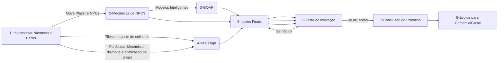

 
:construction: <b> PROJETO EM CONSTRUÇÃO </b> :construction: 

> Protótipo de RPG2D, com sistema de **NavMesh2D**  em Unity3D. Você encontra o pack para baixar e aplicar na Unity aqui -> <https://github.com/h8man/NavMeshPlus>
------
>Segue o planejamento para o protótipo, atualmente está bem inicial, ou seja, na fase 2.

______________________________________________________________________________________________________

 (Imagem - 01: Sistema NavMesh inicial)

______________________________________________________________________________________________________

https://user-images.githubusercontent.com/92175791/206179538-7c889d83-5a04-40f1-889f-ddb3aa8f70ff.mp4

 (Video - 01: Sistema em ação)

______________________________________________________________________________________________________
